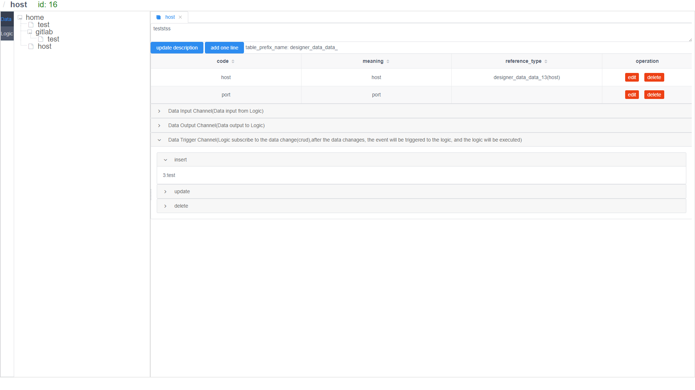
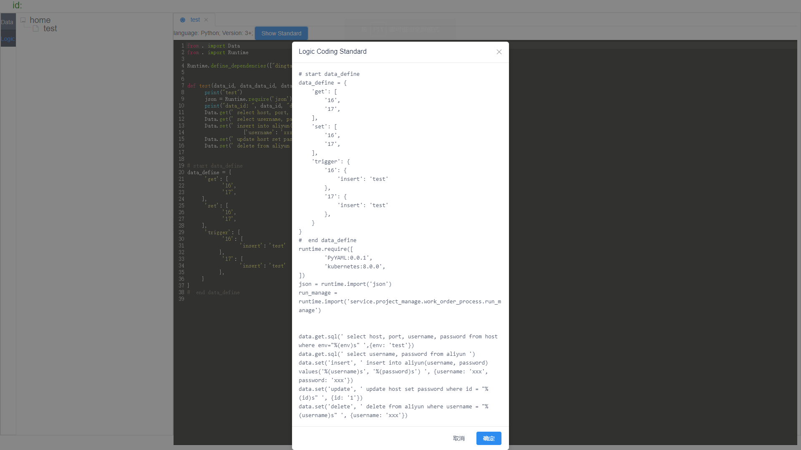
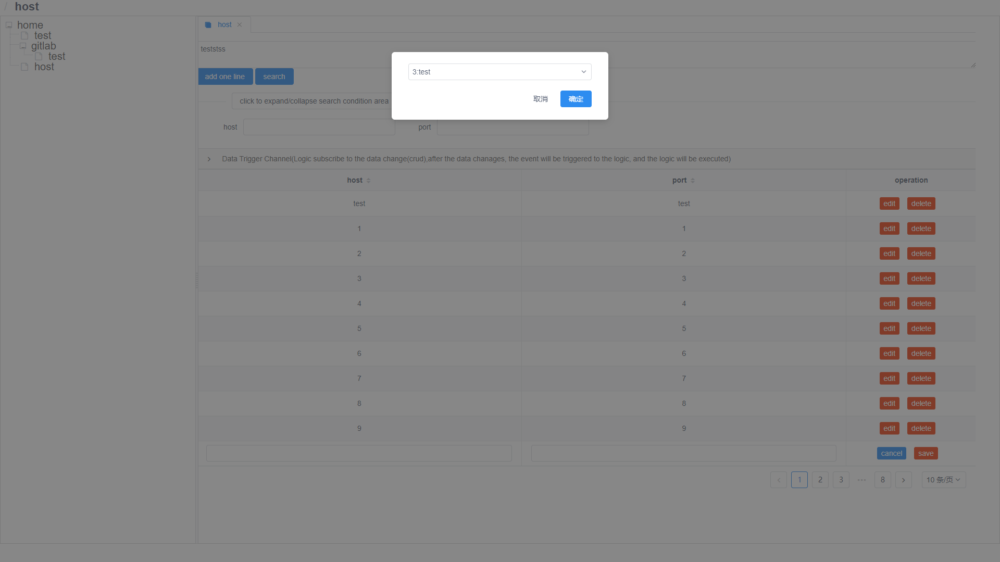
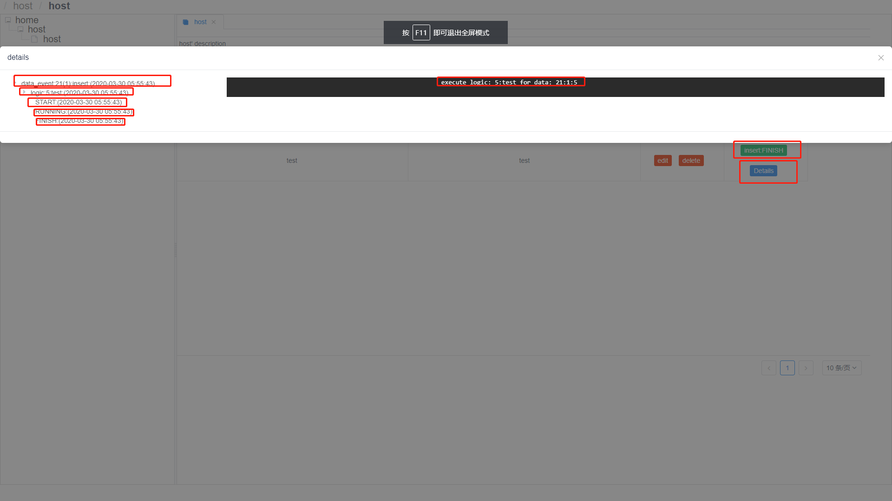

# 产品文档

## [点击打开在线体验](http://129.211.59.74)

## 目前进度

# 部署

## 项目

镜像仓库地址: https://hub.docker.com/r/tanshilindocker/laasops

部署文档请参考 dependency/laasops.sh 文件

## HTTPS

依赖Nginx, 请参考 dependency/nginx.sh 文件

## 中间件

依赖MySQL, 请参考 distribution/dependency/mysql.sh 文件

# 友链

https://github.com/phodal/ledge

